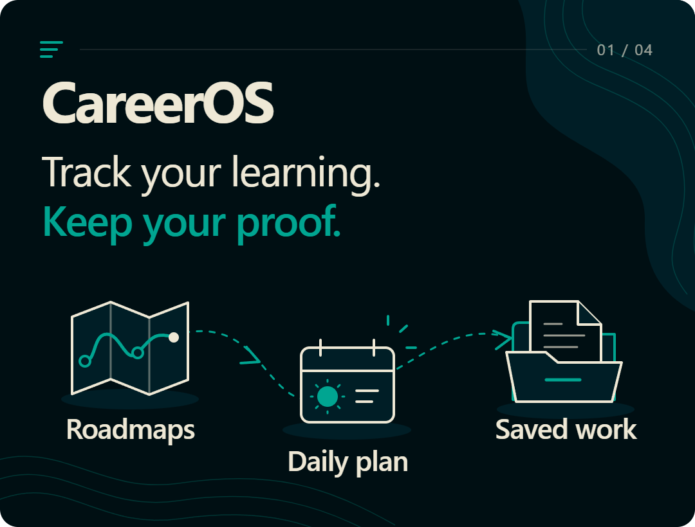
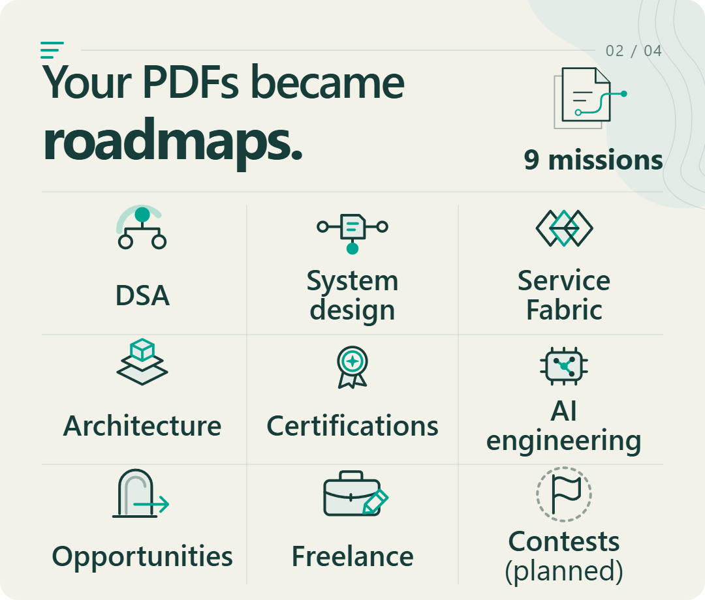
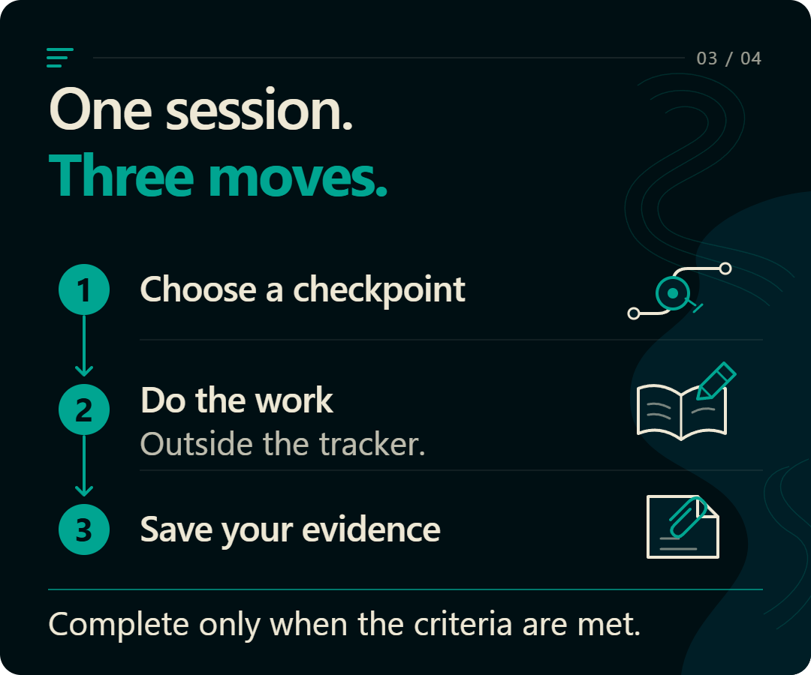
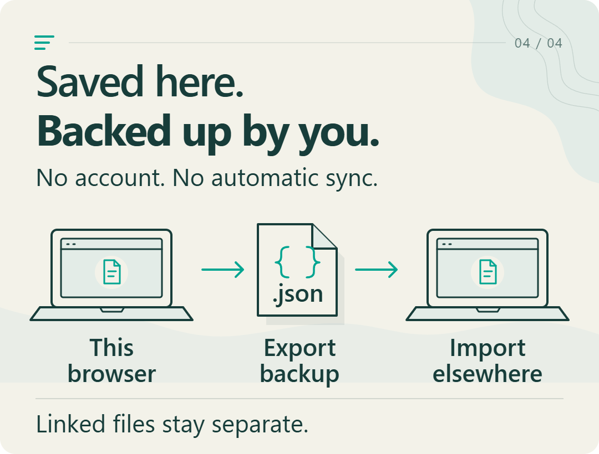

**[Open CareerOS](https://zanark.github.io/CareerHQ/)** · [How to use it](docs/GUIDE.md#start-using-it) · [Developer setup](docs/GUIDE.md#develop-and-verify)

## Your documents, made usable

Open **[Operation documents](https://zanark.github.io/CareerHQ/#/sources)** to explore the content. These are tracking milestones, not full courses or imported achievements.

## One session at a time

New here? Open the website and click **Tutorial**. Practice with the actual controls without changing your progress. Completion is self-confirmed, not AI-graded.

## Know where your progress lives

**[Export a backup](https://zanark.github.io/CareerHQ/#/settings)** before changing devices. Imports replace the destination; backups are not encrypted.

[Full guide](docs/GUIDE.md) · [PDF-to-website mapping](docs/OPERATION-SOURCES.md) · [Privacy](docs/PRIVACY.md) · [DeepSeaFoam theme](docs/THEMES.md)
